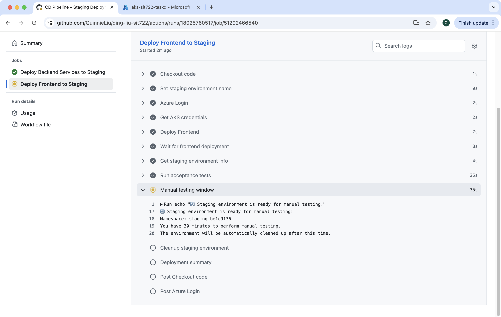

# Detailed documentation

## 1 Create new Github repository


## 2 Create a local project folder


## 3 Push task resources to remote repo


### 3.1 Create necessary Azure resources
```bash
RESOURCE_GROUP="rg-sit722-taskd"
LOCATION="australiaeast"
ACR_NAME="acrsit722taskd"
AKS_NAME="aks-sit722-taskd"
SERVICE_PRINCIPAL_NAME="sp-sit722-cicd"

az group create --name $RESOURCE_GROUP --location $LOCATION

az acr create --resource-group $RESOURCE_GROUP --name $ACR_NAME --sku Basic --admin-enabled true

az aks create \
  --resource-group $RESOURCE_GROUP \
  --name $AKS_NAME \
  --node-count 2 \
  --node-vm-size Standard_B2s \
  --enable-addons monitoring \
  --generate-ssh-keys \
  --attach-acr $ACR_NAME

az aks get-credentials --resource-group $RESOURCE_GROUP --name $AKS_NAME

az ad sp create-for-rbac \
  --name $SERVICE_PRINCIPAL_NAME \
  --role contributor \
  --scopes /subscriptions/$(az account show --query id --output tsv)/resourceGroups/$RESOURCE_GROUP \
  --sdk-auth

az acr show --name $ACR_NAME --query loginServer --output tsv

az acr credential show --name $ACR_NAME
```

### 3.2 Add Github Actions
**CI testing**: https://github.com/QuinnieLiu/qing-liu-sit722/blob/main/.github/workflows/ci-testing-branch.yaml

**CD Staging**: https://github.com/QuinnieLiu/qing-liu-sit722/blob/main/.github/workflows/cd-staging-deployment.yaml

**CD Production**: https://github.com/QuinnieLiu/qing-liu-sit722/blob/main/.github/workflows/cd-production-deployment.yaml

### 3.3 Other code changes
**Github Repo**: https://github.com/QuinnieLiu/qing-liu-sit722/tree/main

**k8s**: https://github.com/QuinnieLiu/qing-liu-sit722/tree/main/k8s

## 4 CI Pipeline run on testing branch commits

### 4.1 Add a commit to testing branch


### 4.2 CI Pipeline triggered


### 4.3 CI Pipeline complete


## 5 CD Staging Pipeline run on completion of CI Pipeline

### 5.1 CD Staging Pipeline triggered


### 5.2 Staging environment created



### 5.3 Visit Frontend in staging environment


**The staging deployment will be cleaned up in 30 minutes automatically or as soon as the CD pipeline is cancelled manually**

## 6 Production deployemnt on closed pull request

### 6.1 Raise PR and merge


### 6.2 CD Production Pipeline triggered on PR


### 6.3 CD Production Pipeline complete


### 6.3 Production environment created


### 6.4 Visit Frontend in production environment
